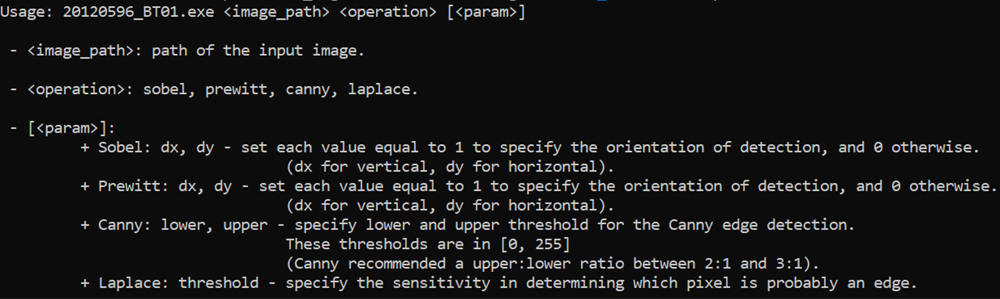
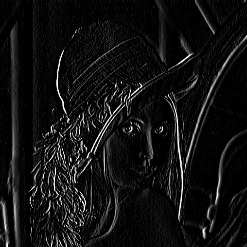
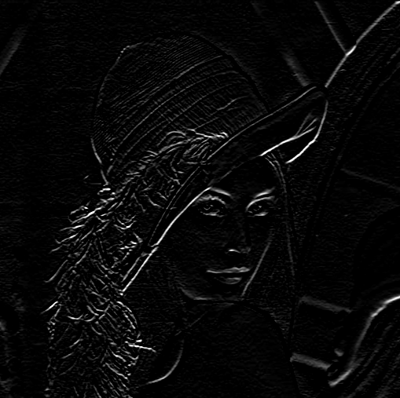
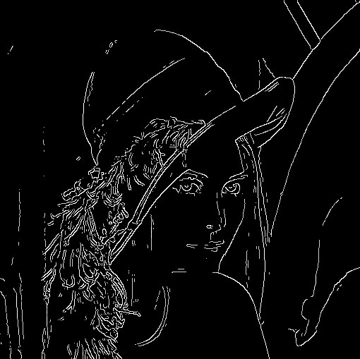
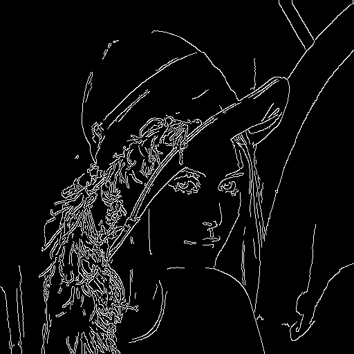

# Edge Detection

This repository contains code for edge detection using various filters such as Prewitt, Sobel, Laplace, and Canny. All of these filters are implemented from scratch using the C++ OpenCV library.

## Dependencies

- Visual Studio 2019 or later.
- OpenCV 4.7.0 or later.

## Installation

1. Clone the repository: `git clone https://github.com/nbtin/edge-detection`
2. Open the project in Visual Studio.
3. Install the OpenCV library for your VS project.
4. Build the project.

## Usage

1. Download the executable file from the Releases page.
2. Download the dll files from the OpenCV library and place them in the same directory as the executable file. 
    
    If you can not find the dll files, you can download them from [here](https://drive.google.com/drive/folders/1B0Sp3VyLvApH-LjP5NbuXux9ckwSwYE9).
3. Run the executable file from the command line with the `help` flag to see the usage instructions. Just replace the exe filename with the one you downloaded from my Releases page.

   

## Examples

Here are some examples of edge detection using different filters for the [Lenna](https://en.wikipedia.org/wiki/Lenna) image:

#### Original Image

    

#### **1. Sobel Filter for detecting Vertical Edges & Horizontal Edges**

  

    
    
  

#### **2. Prewitt Filter for detecting Vertical Edges & Horizontal Edges**

  

    
    
  

#### **3. Laplace Filter & Canny Filter**

  

    
    
  

#### **4. My Implemented Canny vs OpenCV Canny**

  

    
    
  

## Contributing

Contributions are welcome! Please open an issue or pull request for any bug fixes or feature requests.

## License

This project is licensed under the MIT License - see the [LICENSE](LICENSE) file for details.
